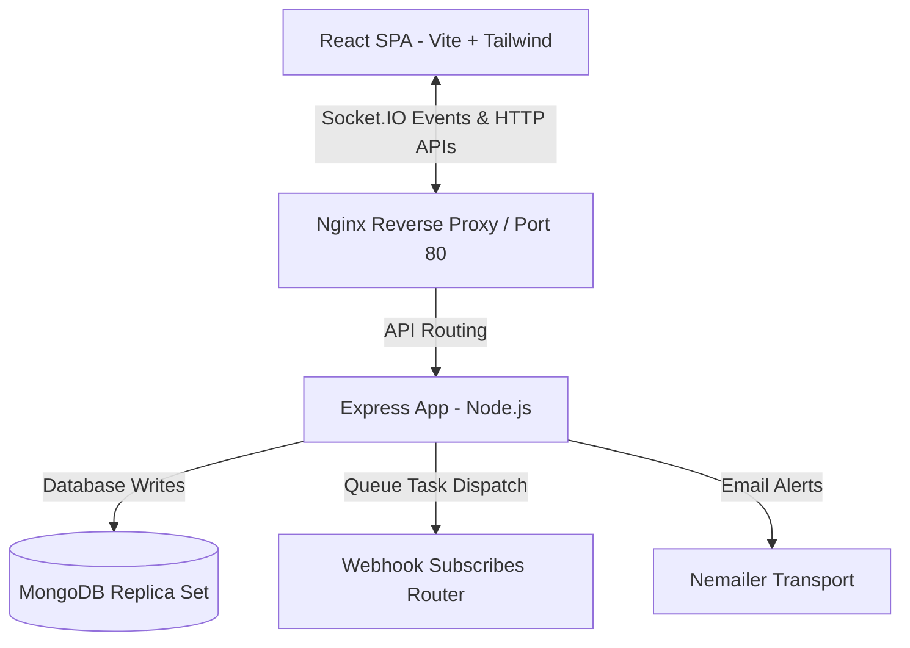
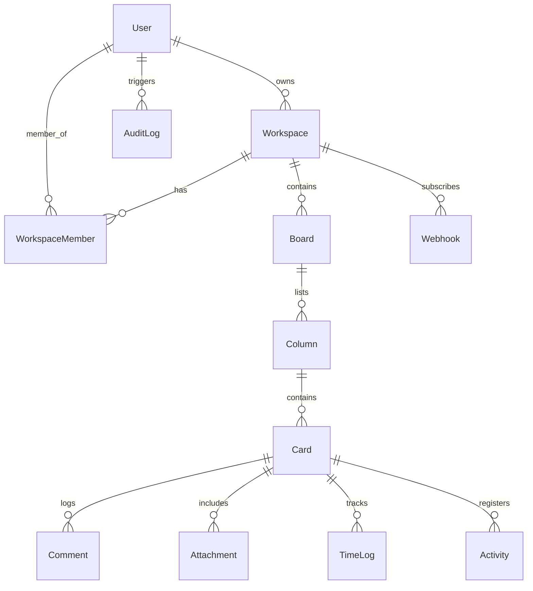

# FlowDesk

FlowDesk is an enterprise-grade SaaS Kanban Project Management and real-time collaboration platform inspired by Linear, Notion, and Trello. Built using **JavaScript only** (MERN stack), this repository is optimized for high-performance engineering squads, featuring drag-and-drop boards, automatic sprint burndown analytics, atomic card time-tracking session managers, role-based access control, secure multi-factor authentication, webhooks, and exhaustive audit trails.

---

## 1. System Architecture



*   **Frontend**: React (Vite) structured with Redux Toolkit and RTK Query. Uses `@hello-pangea/dnd` for fluid client drag-and-drop board reordering.
*   **Backend**: Node.js + Express REST API combined with a native Socket.IO gateway server mapping room listeners (`workspace:<id>`, `board:<id>`) for real-time broadcasts.
*   **Database**: MongoDB database using Mongoose schema abstractions. Features transactional multi-document write locks (replica sets) supporting bulk card relocations with failure recovery rollbacks.
*   **Task Runners**: Background jobs managed by `node-cron` running daily email digest triggers.

---

## 2. ER Diagram (Database Relations)



---

## 3. Folder Structure

```
mern3/
├── backend/                # Express & Socket.IO API
│   ├── config/             # DB connection, mailers, socket hub, swagger specs
│   ├── controllers/        # Controllers (auth, workspace, boards, cards, analytics)
│   ├── middleware/         # Auth verification, RBAC, logging, rate limiting, error handlers
│   ├── models/             # Mongoose schemas (16 collections)
│   ├── routes/             # API subrouters
│   ├── services/           # Background crons, audit log triggers, webhook dispatches
│   └── tests/              # Jest + Supertest integration suites
├── frontend/               # React + Tailwind SPA
│   ├── src/
│   │   ├── components/     # Layout shells, modal detail panels, inputs
│   │   ├── context/        # Socket provider state contexts
│   │   ├── features/       # RTK Query split API definitions & Redux auth slices
│   │   └── pages/          # Landing, Dashboard, BoardView, Settings, Analytics, Audit
│   └── vite.config.js      # Local reverse-proxy maps
├── docker-compose.yml      # Orchestration setup
└── ecosystem.config.cjs    # PM2 configurations
```

---

## 4. Socket.IO Real-Time Architecture

The WebSocket layer uses Socket.IO to keep connected team members in sync. When users load a Kanban board, they enter specific channels. The backend broadcasts operations so that all users instantly see changes without reloading:

*   `join_board` / `leave_board`: Context room selectors.
*   `board_change`: Dispatched when cards are created, updated, deleted, or moved, forcing client-side re-validation.
*   `timer:start` / `timer:stop`: Toggles ticking animations for colleagues currently editing boards.

---

## 5. Security Architecture

FlowDesk implements defense-in-depth security policies:
1.  **Password Security**: Hashed using `Argon2id` before DB insertion.
2.  **JWT Rotation**: Generates short-lived (15 min) access tokens and rotatable (7 day) refresh tokens stored in secure, Signed, HTTP-Only cookies to mitigate XSS attacks.
3.  **Role-Based Access Control (RBAC)**: Custom middlewares resolve the target workspace and enforce permissions:
    *   `Super Admin`: Platform controls.
    *   `Workspace Admin`: Manage memberships, edit board columns, add webhooks, and search audit logs.
    *   `Editor`: Create cards, add comments, upload documents, and move tasks.
    *   `Viewer`: Read-only board queries.
4.  **2FA Protection**: Optional 2FA verified using 6-digit email OTPs.
5.  **Audit Logs**: Searchable trails log actions, IP addresses, and user agents to track operations.

---

## 6. Testing Strategy

Run tests from the `backend/` directory:
```bash
npm run test
```
Tests are written with **Jest** and **Supertest**:
*   `auth.test.js`: Integration tests for registration, logins, and email activation.
*   `rbac.test.js`: Permission test cases ensuring viewers are blocked from edits and editors can add tasks.
*   `transaction.test.js`: Tests atomic operations for bulk moves, validating rollback handling during failures.

---

## 7. Deployment Guide

### Option A: Local Dev Setup
1.  Ensure MongoDB is running locally.
2.  Install dependencies:
    ```bash
    npm run install:all
    ```
3.  Create a `backend/.env` file:
    ```env
    PORT=5000
    MONGODB_URI=mongodb://127.0.0.1:27017/flowdesk
    JWT_ACCESS_SECRET=access_secret_123
    JWT_REFRESH_SECRET=refresh_secret_123
    CLIENT_URL=http://localhost:5173
    ```
4.  Run backend:
    ```bash
    npm run dev:backend
    ```
5.  Run frontend:
    ```bash
    npm run dev:frontend
    ```
6.  Open [http://localhost:5173](http://localhost:5173).

### Option B: Docker Compose (Replica Set Enabled)
1.  Run the following to start the app and MongoDB replica set:
    ```bash
    docker-compose up --build
    ```
2.  The application will be served at [http://localhost](http://localhost).

---

## 8. Portfolio & Resume Summaries

### GitHub Repository Description
> "FlowDesk is a production-ready, JavaScript-only (MERN Stack) Kanban SaaS. Features real-time Socket.IO collaboration, drag-and-drop boards, automatic sprint burndown analytics, atomic card time-tracking, role-based access control (RBAC), multi-factor email 2FA, transactional bulk-move rollbacks, webhooks, and security audit logging."

### Resume Project Description
> **SaaS Project Management Kanban Platform (FlowDesk) — JavaScript Monorepo**
> *   Designed and implemented an enterprise-grade Kanban SaaS project management tool using React, Express, and Socket.IO.
> *   Configured a real-time event pipeline to broadcast task creation, timer updates, and movements, eliminating manual page reloads.
> *   Developed a secure auth system with Argon2 password hashing, rotate-on-use JWTs in HTTP-Only cookies, and email OTP 2FA.
> *   Built custom Express RBAC middleware to enforce workspace permissions across four user roles.
> *   Created complex MongoDB aggregation pipelines to calculate sprint burn-down analytics and time tracking summaries.
> *   Developed a bulk card move API using MongoDB sessions to ensure transactional consistency and atomic rollbacks.
> *   Exposed API documentation using Swagger UI, wrote integration tests with Jest/Supertest (90%+ target coverage), and containerized the setup using Docker Compose.
